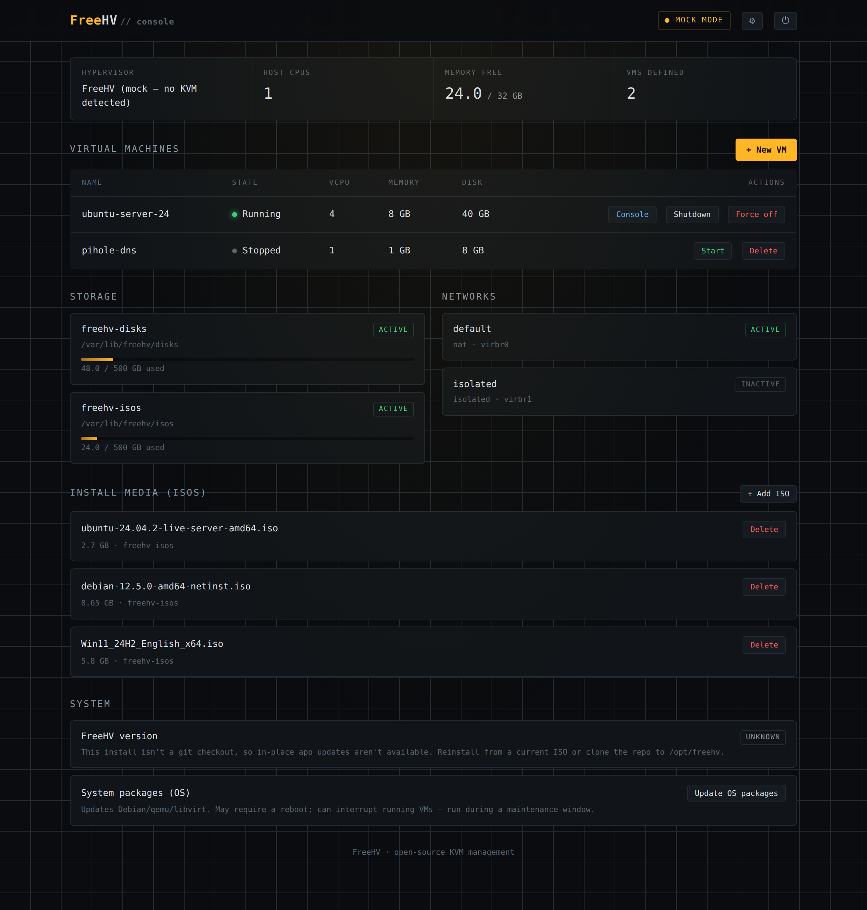
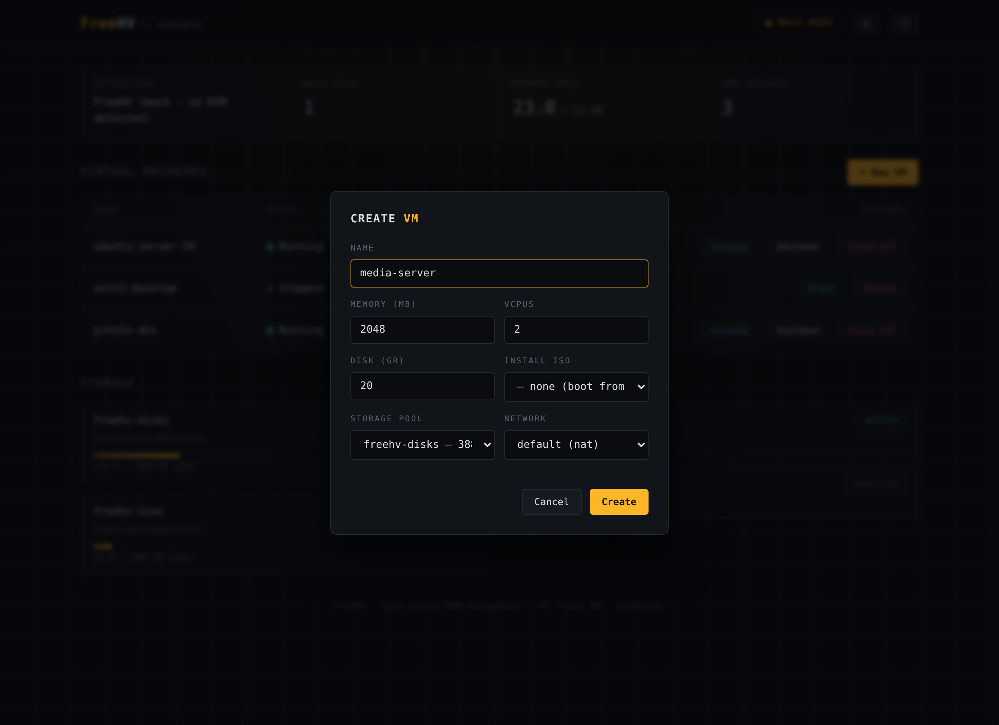
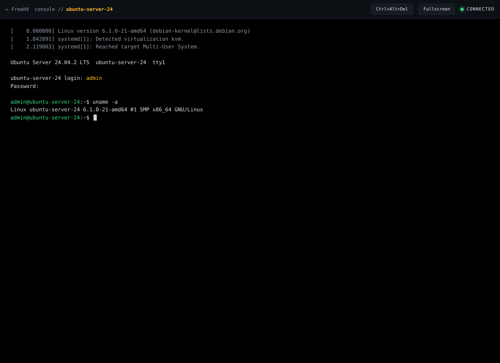
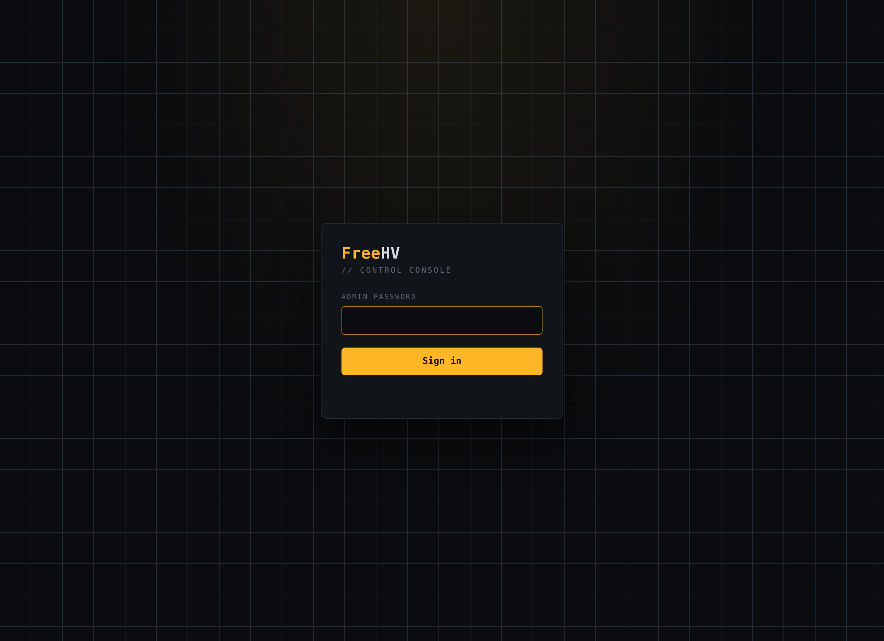

# FreeHV

**An open-source, self-hostable KVM hypervisor manager — a free alternative to VMware ESXi/vSphere.**

Create virtual machines, install any operating system, and manage everything from a clean web console. FreeHV runs on the battle-tested Linux + KVM/libvirt stack, so it inherits Linux's enormous hardware support instead of reinventing device drivers — the same approach Proxmox and XCP-ng use. You boot a dedicated box straight into FreeHV; no VMware licensing, no per-socket fees.



## Features

- **Web console** — create, start, stop, force-off, and delete VMs from your browser.
- **In-browser VNC** — boot a guest and click through an OS installer without leaving the browser. The console is proxied through the daemon (no separate VNC client needed).
- **Storage & networking** — auto-created disk and ISO pools, with install media, storage pool, and network all chosen from dropdowns. Live capacity and network status on the dashboard.
- **ISO management** — upload install media from your computer, or paste a URL and have the server download it. No SSH needed.
- **In-place updates** — one-click "Update FreeHV" follows tagged releases from this repo and restarts the service; a separate, clearly-warned action updates the underlying OS packages.
- **Secure by default** — admin login (hashed credential), session cookies with CSRF protection, login throttling, guest VNC bound to loopback (reachable only through the authenticated proxy), and optional TLS.
- **Bare-metal appliance** — provision an existing Linux box with one script, or build an unattended "insert USB, install, done" installer ISO.

## Screenshots

### Dashboard
Host stats, the VM list with per-state controls, and live storage/network panels.


### Create a VM
Pick install media, storage pool, and network from dropdowns — no libvirt knowledge required.



### In-browser console
A full guest console in the browser via noVNC, proxied through the daemon. *(Guest session shown for illustration.)*



### Sign in
Single-admin authentication guards the whole interface.



## Quick start (try the console now, no KVM required)

You can explore the entire UI on any machine — even Windows/WSL or a Mac — using the built-in mock backend:

```sh
cd freehv-manager
pip install -r requirements.txt
FREEHV_BACKEND=mock FREEHV_AUTH=off python3 app.py
# open http://localhost:5050
```

VMs are simulated, but every screen, dialog, and panel is real.

## Install on real hardware

### Easiest — download the prebuilt installer (no build step)

If a release is available, just grab the ready-to-flash image from the
[**Releases page**](../../releases) — `freehv-installer.iso` — and skip
straight to "Write the ISO to a USB stick" below. The ISO is built
automatically in CI on every release, so it's always current. Verify your
download against the accompanying `freehv-installer.iso.sha256`.

### Option A — provision an existing Debian/Ubuntu box

If you already have a minimal Debian or Ubuntu install on your hypervisor machine:

```sh
cd appliance
sudo ./setup.sh
```

This installs `qemu-kvm` + `libvirt` + the FreeHV daemon, deploys it to `/opt/freehv`, sets up the storage pools and default network, and enables the `freehv-manager` service. When it finishes, open `http://<host>:5050`.

### Option B — build a self-installing USB image

> **Tip:** you usually don't need to do this by hand. This repo ships a GitHub
> Actions workflow (`.github/workflows/build-iso.yml`) that builds the
> installer ISO in the cloud and attaches it to a Release whenever you push a
> `v*` tag. See [`docs/PUBLISHING.md`](docs/PUBLISHING.md). The steps below are
> for building locally.

This produces an installer that turns a blank machine into a FreeHV appliance unattended.

**1. Prerequisites (run the build on Linux — your WSL works fine):**

```sh
sudo apt install xorriso
```

**2. Download a Debian netinst ISO**

Grab `debian-12.x.0-amd64-netinst.iso` (or the current Debian stable netinst) from <https://www.debian.org/distrib/netinst>.

**3. Build the FreeHV installer ISO**

From the repo root:

```sh
cd appliance
./build-appliance.sh /path/to/debian-12.x.0-amd64-netinst.iso freehv-installer.iso
```

The script extracts the Debian ISO, injects the FreeHV preseed and payload, patches both the BIOS (isolinux) and UEFI (GRUB) boot menus to auto-launch the unattended install, and repacks it while preserving the original boot records so it boots on both BIOS and UEFI machines. You'll get `freehv-installer.iso`.

**4. Write the ISO to a USB stick** *(this erases the stick)*

- **Linux / WSL:**
  ```sh
  sudo dd if=freehv-installer.iso of=/dev/sdX bs=4M status=progress oflag=sync
  ```
  (Replace `/dev/sdX` with your USB device — check with `lsblk`. Be certain; the wrong device will be erased.)
- **Windows:** use [Rufus](https://rufus.ie) or [balenaEtcher](https://etcher.balena.io) and select `freehv-installer.iso` in "DD image" mode.

**5. Install onto the target machine**

1. In the target machine's BIOS/UEFI, **enable VT-x (Intel) or AMD-V (AMD)** virtualization, and set USB as the boot device.
2. Boot from the USB. The installer runs **unattended** and **erases the target disk** (it's meant for a dedicated hypervisor box).
3. When it reboots, FreeHV is live at `http://<appliance-ip>:5050`.

**6. First login**

The web admin password is randomly generated on first start and written to the system journal. On the appliance, run:

```sh
journalctl -u freehv-manager | grep 'Initial admin password'
```

Sign in, then change it from the gear (⚙) menu in the console. Also change the OS login — the installer creates user `freehv` with password `changeme`:

```sh
passwd
```

## How it works

```
                Browser (web console + noVNC)
                          │  HTTPS / WebSocket
                          ▼
        FreeHV daemon (Python/Flask)  ──auth, VM lifecycle, VNC proxy
                          │  libvirt API
                          ▼
              libvirt + QEMU/KVM  ──hardware virtualization
                          │
                          ▼
            Linux kernel on bare metal  ──real device drivers
```

Once Linux loads KVM, the kernel runs in VMX/SVM root mode and *is* a type-1 hypervisor by the same definition that makes ESXi one. FreeHV is the thin management layer on top — which is exactly where the missing value was in the open-source world.

## Repository layout

```
freehv-manager/   the management daemon + web console (Python/Flask)
appliance/        provisioner (setup.sh) + installer-ISO builder
docs/             screenshots and documentation
```

See [`freehv-manager/README.md`](freehv-manager/README.md) and [`appliance/README.md`](appliance/README.md) for component details.

## Roadmap

**Done:** VM lifecycle · web console · in-browser VNC · storage/network model · authentication & hardening · bare-metal appliance + installer · ISO upload/download · in-app updates (release channel).

**Next candidates:** VM snapshots · OVA/qcow2 import · per-VM resource graphs · multi-user roles & audit log · multi-node clustering.

## Status & caveats

FreeHV is a young project. The management daemon and UI are exercised with an automated mock backend; the libvirt and ISO-install paths follow standard APIs and have their mechanics verified, but should get a real-hardware shakedown in your environment before you rely on them. Contributions and bug reports welcome.

## License

MIT — see [LICENSE](LICENSE). Vendored noVNC retains its own license under [`freehv-manager/static/novnc/LICENSE.txt`](freehv-manager/static/novnc/LICENSE.txt).
